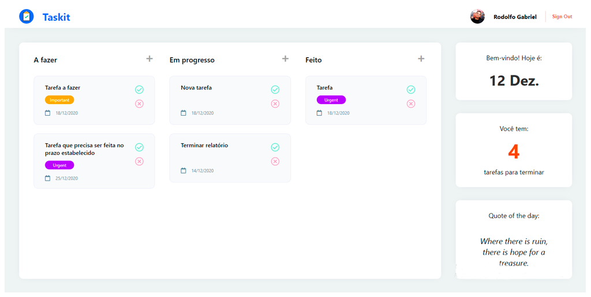

# Todo App

App de Tarefas feito com React e Firebase

Live demo: https://tarefas-app.netlify.app/

## Tecnologias utilizadas:

- [React](https://reactjs.org/)
  - Context API
- [styled-components](https://styled-components.com/)
  - Global styles
  - Theme Provider
- [React Beautiful dnd](https://github.com/atlassian/react-beautiful-dnd)
  - Utilizado no efeito de drag and drop
- [Firebase](https://firebase.google.com/)
- [Google OAuth 2.0](https://developers.google.com/identity/protocols/oauth2)

## Funcionalidades

- Funcionalidade Drag and Drop que altera a categoria das tarefas (ex: a fazer => feito)
- Autenticação com Google OAuth 2.0
- Criar tarefas com título, urgência e prazo de entrega
